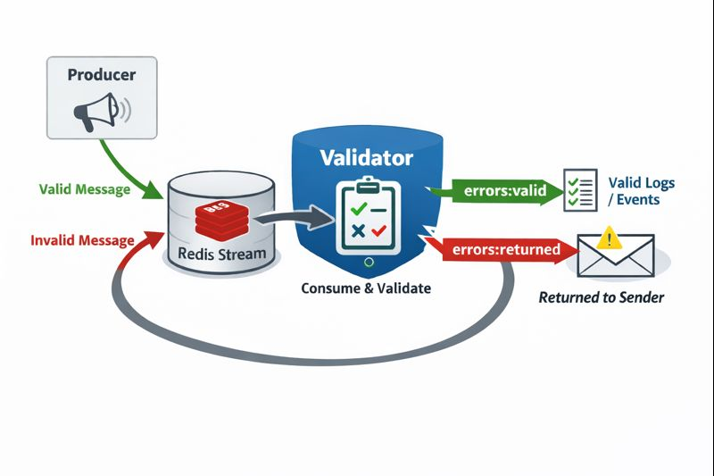

## TL;DR

**Return2Sender** demonstrates a simple pattern for enforcing structured logs **without breaking producers**.

Applications send logs (good or bad) into a single Redis stream. A validator checks each message against a schema and:
- routes **valid messages** to a clean stream for downstream consumers
- routes **invalid messages** to a separate stream for inspection and correction (returning to sender)

This allows SRE / Support teams to depend on high-quality, predictable data **without owning how logs are produced**, and helps dev teams catch logging issues early during QA or UAT — improving reliability without adding process or bureaucracy.

# Return2Sender Demo

A minimal Redis Streams / Pydantic demo illustrating structured error handling and routing with *“return to sender”* semantics.

This demo shows how logging standards can be programmatically enforced for arbitrary applications feeding into an SRE / Support environment.  
**The concept is intended to be used during development or QA — before applications begin logging into production systems.**

---

## Concept

In modern SRE / support setups, teams rely heavily on logs and structured events to monitor, troubleshoot, and resolve issues effectively. However, these teams often **do not control how logs are generated** — messages may come from multiple services, external tools, or legacy systems, and may be inconsistent or incomplete.

The `return2sender` pattern provides a simple way to enforce structure **without breaking producers**:

- **Producer**  
  Sends log or error messages — both *valid* and *invalid* — into a single Redis stream.

  - “Good” messages contain the structured fields required for effective operational response.
  - “Bad” messages may be incomplete, malformed, or otherwise unsuitable for downstream tooling.

- **Validator**  
  Consumes messages from the stream, validates them against a schema, and routes them accordingly:
  - **Valid messages** → `errors:valid`
  - **Invalid messages** → `errors:returned` (on a *separate* channel for inspection or correction)

This ensures downstream consumers only see clean, predictable data, while preserving full visibility into malformed or incomplete messages.

Rather than rejecting or dropping data, invalid messages are **returned with feedback**, enabling improvement without blocking deployments or disrupting existing systems.

This approach is particularly useful as part of a **QA / UAT process**, allowing development teams to immediately see issues they may have missed when writing logging code. By returning malformed messages in a controlled (and potentially enriched) way, teams can improve log quality and reliability **without adding bureaucracy or interfering with workloads already in production**.



---

## Setup

```bash
# Start Redis + Validator container
./start_demo.sh

# In a terminal, watch validator logs
docker logs -f return2sender_validator_1
```

## Sending Messages
In another terminal, send messages on demand

```bash
docker exec -it return2sender_validator_1 python3 /app/producer/producer.py
```

- Validator logs immediately show which messages are valid and which are returned.

- Each run of the producer emits one valid and one invalid message, clearly demonstrating cause → effect.

## Stopping The Demo

```bash
./stop_demo.sh
```

- The producer runs interactively inside the validator container for simplicity.

- This project is purely illustrative; the focus is on message flow and structured validation, not production hardening.

- Conceptually, return2sender can be extended to any streaming or event-driven pipeline where input may be unreliable or unstructured.

## Further Work
Enriched rejection information in many forms is possible by extending this pattern with automation or LLMs. For example:

- Runbook references validated against source repositories or specifications

- Automated verification of server access credentials

- RSA key or certificate validation

- Order, protocol, or message validation (e.g. FIX)

These extensions turn rejection into **actionable feedback**, helping application teams correct issues earlier and improve overall operational quality.